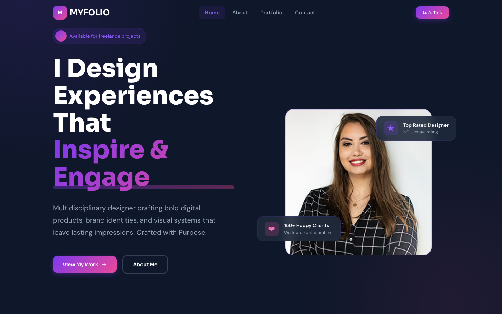

# MYFOLIO — Personal Portfolio HTML Template

> **Crafted with Purpose.**

A premium, framework-free personal portfolio template built with semantic HTML5, CSS custom properties, and vanilla JavaScript. Designed for creative professionals who want a bold, memorable online presence.

---

## 📸 Screenshot



## Brand

| Token | Value |
|-------|-------|
| Primary | `#7C3AED` (Violet) |
| Secondary | `#EC4899` (Pink) |
| Dark | `#0F172A` |
| Heading Font | Sora |
| Body Font | DM Sans |

---

## Pages

| Page | File | Description |
|------|------|-------------|
| Home | `index.html` | Hero section, about preview, featured portfolio grid, skills showcase, testimonials, contact CTA, footer |
| About | `about.html` | Personal story, skill proficiency bars, career timeline, contact CTA |
| Portfolio | `portfolio.html` | Filterable project grid with category tabs (Brand Identity, Web Design, UI/UX, E-Commerce, Motion) |
| Contact | `contact.html` | Contact info card with social links, multi-field form with `data-form="contact"`, location section |

---

## Features

- **Zero Dependencies** — No frameworks, no build tools, just HTML/CSS/JS
- **Fully Responsive** — Mobile-first design with breakpoints at 480px, 768px, and 1024px
- **CSS Custom Properties** — Complete design token system for easy customization
- **Scroll Reveal Animations** — Intersection Observer-based entrance animations
- **Sticky Header** — Glass-morphism header on scroll with backdrop blur
- **Portfolio Filtering** — Category-based filter tabs on portfolio page
- **Animated Counters** — Hero statistics with smooth count-up animation
- **Skill Bar Animations** — Proficiency bars animate on scroll into view
- **Mobile Navigation** — Full-screen overlay menu with hamburger toggle
- **Scroll-to-Top** — Floating button appears after scrolling
- **Form Handling** — Contact form with loading/success states

---

## File Structure

```
personal-portfolio-html-template/
├── index.html
├── about.html
├── portfolio.html
├── contact.html
├── README.md
├── assets/
│   ├── css/
│   │   └── style.css          (600+ lines, full design system)
│   ├── js/
│   │   └── main.js            (all interactive behaviors)
│   └── img/
│       ├── profile-pic.jpg
│       ├── about-us.jpg
│       ├── portfolio-1.jpg
│       ├── portfolio-2.jpg
│       ├── portfolio-3.jpg
│       ├── portfolio-4.jpg
│       ├── portfolio-5.jpg
│       ├── portfolio-6.jpg
│       ├── testimonial-1.jpg
│       ├── testimonial-2.jpg
│       ├── testimonial-3.jpg
│       ├── testimonial-bg.jpg
│       └── top-header.jpg
```

---

## Quick Start

1. Open `index.html` in any modern browser — no server required.
2. Replace `assets/img/` images with your own photos and project screenshots.
3. Edit text content directly in the HTML files.
4. Customize colors by updating CSS custom properties in `:root` inside `assets/css/style.css`.

---

## Customization

### Colors

Change the brand palette by editing the CSS custom properties at the top of `assets/css/style.css`:

```css
:root {
  --color-primary: #7C3AED;
  --color-secondary: #EC4899;
  --color-dark: #0F172A;
}
```

### Typography

Swap fonts by changing the Google Fonts `<link>` tag in each HTML file and updating the `--font-heading` / `--font-body` variables.

### Content

All text is editable directly in the HTML. Project cards, testimonials, timeline entries, and skill bars can be duplicated or removed as needed.

---

## Request a Custom Template

Need a tailored version of this template for your specific use case?

[**Request a Custom Template**](https://tally.so/r/q4q1L9)

---

## License

Free for personal and commercial use. Attribution appreciated but not required.
